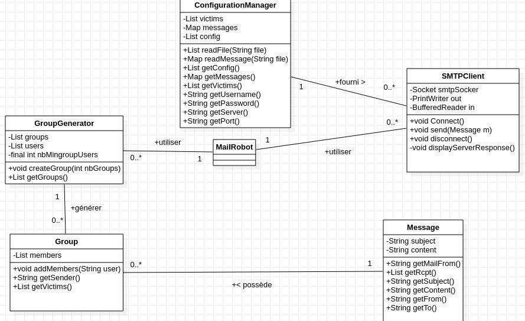

# Teaching-HEIGVD-RES-2019-Labo-SMTP   

## Description

Dans le cadre du cours de RES de l'HEIG-VD nous avons mis en place un système de prank. Pour cela nous allons simuler un serveur SMTP avec MockMock et MailTrap. Le prank procède ainsi : Nous fournissons une liste de messages, des victimes et une configuration pour se connecter au serveur SMTP. Nous devons créer des groupes de personnes. Avec ces derniers, parmis les personnes dans le groupe nous allons choisir un envoyeur et le reste des personnes seront les récépteurs. En choisissant un message parmis tout ceux existant, le sender enverra ce message à tous les autres membres de son groupe.

## Mock Mock Serveur

Afin de tester notre applicaton, nous avons mis à disposition un Dockerfile. Celui va créer une image, qui en la lançant, va lancer un serveur MockMock. Pour se connecter au serveur SMTP, il faut utiliser le port 2525. Un interface web et mise à disposition pour voir si les mails que notre application envoie passe. Celle-ci est disposible à l'adresse 127.0.0.1:8282. Pour pouvoir utiliser se serveur, il faut avoir Docker installer sur votre machine. Voici les commandes à lancer dans votre terminal pou que le serveur MockMock fonctionne :

<ul>
    <li>docker build -t mockmock . </li>
    <li>docker run -d -t -p 8080:8282 -p 2525:2525 --name mockmockServer mockmock</li>
</ul>

## Implémentation 

Dans notre implémentation, nous avons plusieurs classes à disposition :

<ul>
    <li>SMTPClient : cette classe va créer un socket afin de se connecter au serveur SMTP. Elle permet aussi d'enoyer des messages au serveur ainsi que d'afficher ses réponses</li>
    <li>GroupGenerator : cette classe prend en entrée une liste de String qui contient le mail de tous les utilisateurs à qui nous allons envoyé un mail. La fonction createGroups permet de générer plusieurs groupes de mails. On peut lui passer le nombre de groupes a générer en paramètre. Il y a une contraintre pour la génération de groupe, celui-ci doit contenir au minimum 3 mails.</li>
    <li>Group : cette classe représente les groupes générés par la classe GroupeGenerator. Elle possède une liste qui contient tous les membres du groupe. Une fonction addMembers permet d'ajouter un membre à cette liste. Dans notre choix d'implémentation, nous avons choisis de prendre le premier mail dans la liste comme sender et le reste des utilisateurs sont les personnes qui reçoivent le mail.</li>
    <li>Message : cette classe permet de lier le message à envoyer à un groupe d'utilisateur. Elle permet aussi de générer tous les messages utiles à l'envoi du message au serveur SMTP (getMailFrom, getRcpt, getSubject, getContent, getFrom, getTo).</li>
    <li>
        ConfigurationManager : cette classe permet de lire tous les fichiers de configuration nécessaire au fonctionnement de l'application. La fonction propose une fonction readFile qui retourne une liste de string contenant chaque ligne du fichier lu. Cette fonction est utilisé pour lire les fichier config.properties et victims.txt. Pour lire le ficheir de message, la classe propose une autre fonction (readMessage) qui retourne un map qui conetient comme clé le sujet du message et comme valeur liée à la clé le contenu de message. Finalement, les fontions getUsername, getPassword, getServer, getPort qui permettent de retourner toutes les options utiles à la connection au serveur SMTP.
        <ul>
            <li>config.properties : contient toutes les informations pour se connecter au serveur SMTP</li>
            <li>messages.txt : contient tous les messages à envoyer (sujet, contenu) délimités par ==</li>
            <li>victims.txt : contient tous les mails que l'application va utiliser pour envoyer les mails. Ce fichier doit contenir un mail par ligne pour que la lecture se fasse correctement.</li>
        </ul>
    </li>
</ul>

Pour utiliser notre application, il suffit simplement de modifier les fichiers de configuration cités précédemment. En lançant l'application, celle-ci vous demandera le nombre de groupes que vous voulez générer ainsi que si vous voulez utiliser le login pour vous connecter au serveur SMTP ou non. Ensuite l'application se chargera de générer les groupes et d'envoyer les mails.

## Schéma UML

